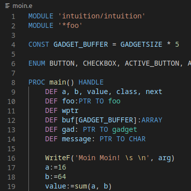
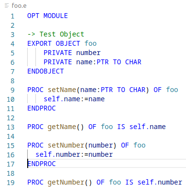

# Amiga E extension for Visual Studio Code

A [Visual Studio Code](https://code.visualstudio.com/) [extension](https://marketplace.visualstudio.com/VSCode) wich provides syntax highlighting and code snippets for [Amiga E](http://strlen.com/amiga-e/).

The original Amiga E compiler by [Wouter van Oortmerssen](http://strlen.com/) is available on [Aminet](http://aminet.net/dev/e).

To compile and run Amiga E code, I use [FS-UAE](https://fs-uae.net/) with a host directory mounted as harddisk on the emulator which contains the source code and edited my .e source files with Visual Studio Code on the host machine.

## Features

This extension enables code highlighting and provides code snippets for the Amiga E programming language in Visual Studio Code.

## Release Notes

Several grammar fixes and introduction of code snippets.

### 0.2.1

 - Update this REAME file and the git repository link

### 0.2.0

 - Introduced code snippets for function, class and the loop types
 - Fixed and enhanced grammar
    - Added RETURN, VOID and SET keywords
    - Added types for variable declaration

### 0.1.7

- Fixed and completed object and member modifiers

### 0.1.4

- Added SELECT .. OF block syntax

### 0.1.3

- Fixed IF grammar bug
- Added grammar for SELECT block and LOOP block
- Added keywords SIZEOF, DEC, INC, JUMP and EXIT

### 0.1.0

- Code and syntax highlighting for Amiga E is implemented